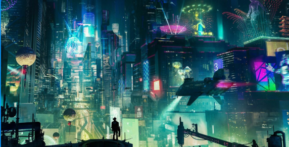

# 💡 Prototipo Figma

## Vistas

#### Menú de inicio

<figure><figcaption></figcaption></figure>

#### Inicio de sesión

<figure><figcaption></figcaption></figure>

#### Registro

<figure><figcaption></figcaption></figure>

#### Menú del juego

<figure><figcaption></figcaption></figure>

#### Batalla

<figure><figcaption></figcaption></figure>

#### Personajes

<figure><figcaption></figcaption></figure>

#### Ejemplo de escenario

<figure><figcaption></figcaption></figure>
